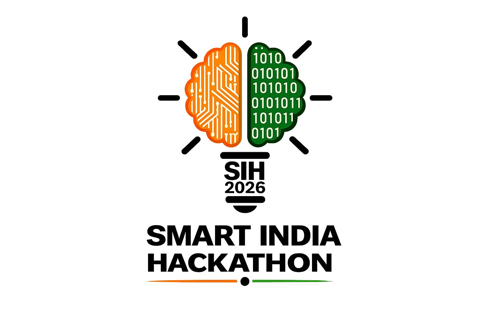
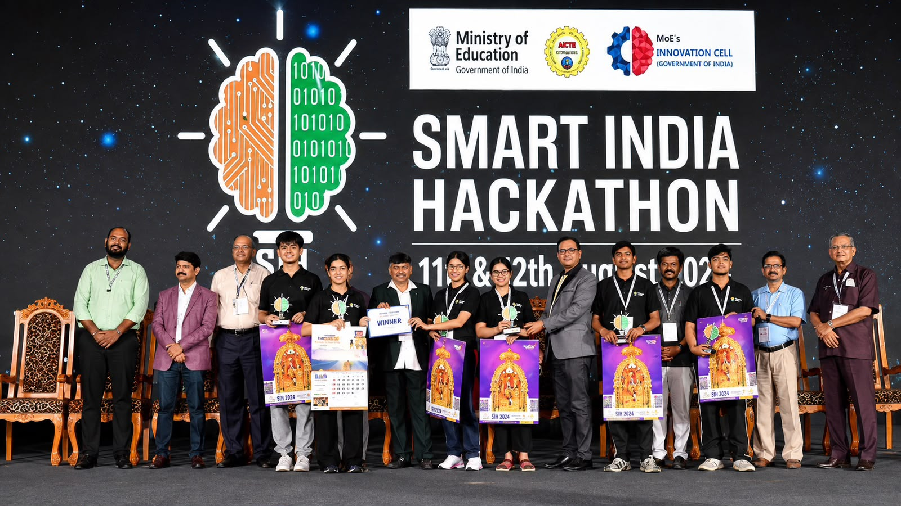

# 🏆 Smart India Hackathon 2026 – Winners PPT & Resources

<div align="center">



### 🚀 Your Complete Resource Hub for Smart India Hackathon Preparation

**Learn from Winners • Build Better • Present Stronger • Win SIH 🏆**

</div>

---

🔥 Want Previous SIH Winners' PPTs & Source Code?
🏆 ACCESS THE SIH WINNERS VAULT (2023–2025) 🚀
https://superprofile.bio/vp/sih-winners-vault-2026-%E2%80%93-ppts---source-code--2023-25-

Learn from winners. Build better. Win SIH! 🏆

## 🌟 About This Repository

Welcome to **SIH Winners PPT & Resources**! 🇮🇳

This repository is a curated collection of **Smart India Hackathon winning project presentations, resources, preparation materials, and useful references** designed to help students and teams prepare better for one of India's biggest innovation competitions.

Whether you're participating in your **first SIH** or aiming to take your project to the next level, this repository will help you understand:

* 💡 How winning teams structure their ideas
* 📊 How to create a powerful SIH presentation
* 🏗️ How successful projects are designed and explained
* 🎯 How to present your solution effectively
* 🚀 What makes a project stand out from thousands of teams

> **Learn from the best, improve your idea, and build your own winning journey. 💪**

---

## 🏆 Smart India Hackathon

<div align="center">



### 🎉 Innovation • Technology • Teamwork • Impact

</div>

**Smart India Hackathon (SIH)** is a nationwide initiative that brings together students, innovators, industry experts, and government organizations to solve real-world problems using technology and innovation.

This repository is created to make valuable **SIH learning resources easily accessible** to students and aspiring innovators.

---

# 📂 Repository Contents

## 📊 1. Winners' Presentations (PPTs)

Explore presentation structures and ideas from successful SIH teams.

You can learn:

* Problem Statement Understanding
* Proposed Solution
* System Architecture
* Technology Stack
* Innovation & Uniqueness
* Implementation Plan
* Impact & Scalability
* Future Scope

📁 **Location:** `Winners-PPTs/`

---

## 🧠 2. Project Resources

Useful resources to help you build and improve your SIH project.

Includes:

* 📄 Research Materials
* 🔗 Useful Links
* 🛠️ Development Resources
* 🎨 Design & Presentation References
* 🤖 AI & Technology Tools
* 📚 Learning Materials

📁 **Location:** `Resources/`

---

## 🎯 3. PPT & Presentation Guide

A strong idea is important, but **how you present it also matters!**

Here you can find resources and references to help create a powerful presentation.

### Recommended SIH PPT Structure

```text
1. Title & Team Introduction
        ↓
2. Problem Statement
        ↓
3. Proposed Solution
        ↓
4. How the Solution Works
        ↓
5. System Architecture
        ↓
6. Technology Stack
        ↓
7. Innovation / Unique Features
        ↓
8. Implementation & Feasibility
        ↓
9. Impact & Benefits
        ↓
10. Future Scope
```

📁 **Location:** `PPT-Guides/`

---

# 🚀 How to Use This Repository

### Step 1️⃣

Browse the **Winners-PPTs** folder and study how successful teams structured their solutions.

### Step 2️⃣

Understand the **problem → solution → technology → impact** flow.

### Step 3️⃣

Use the resources and references to research your own problem statement.

### Step 4️⃣

Create your own unique solution. **Don't copy projects—learn from their approach and improve your own idea.**

### Step 5️⃣

Build, test, prepare your presentation, and give your best at SIH! 🔥

---

# 💡 Tips for SIH Participants

> ### 🥇 Focus on the Problem, Not Just the Technology

A powerful project should solve a **real problem** effectively.

* Understand the problem deeply 🔍
* Identify the real users 👥
* Build a practical solution 🛠️
* Add meaningful innovation 💡
* Make the solution scalable 📈
* Explain everything clearly 🎤

### Remember:

**Simple + Practical + Innovative + Impactful = Strong SIH Project 🚀**

---

# 🤝 Contribute to This Repository

Have an amazing SIH resource, winning presentation, useful tool, or guide? Contributions are welcome! ❤️

You can help by:

* 📤 Adding useful SIH resources
* 📊 Sharing publicly available presentations
* 🔗 Adding valuable references
* 📝 Improving documentation
* ⭐ Suggesting better learning materials

### Contribution Steps

1. Fork this repository 🍴
2. Create your feature branch
3. Add your valuable resource
4. Commit your changes
5. Submit a Pull Request 🚀

---

# ⭐ Support This Repository

If these resources help you, please consider:

⭐ **Starring this repository**
🔄 **Sharing it with your SIH team and friends**
🤝 **Contributing valuable resources**

Your support can help thousands of students prepare better for **Smart India Hackathon**! 🇮🇳🚀

---

<div align="center">

## 🏆 Dream Big. Innovate. Build. Win.

### 🚀 Let's Create the Next SIH Winning Project!


**Made with ❤️ for the Indian Student & Innovation Community 🇮🇳**

<br/>

### ⭐ If you find this repository helpful, don't forget to Star it! ⭐

</div>
