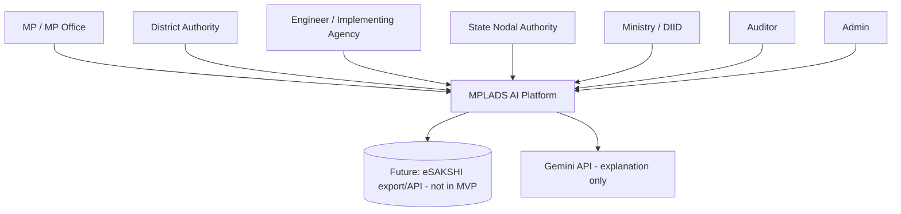
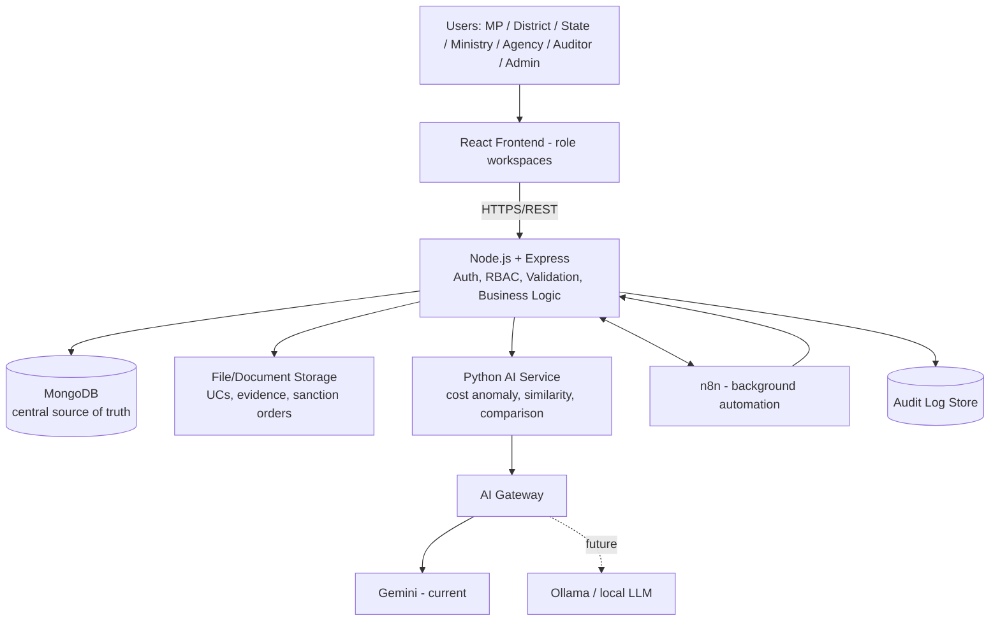
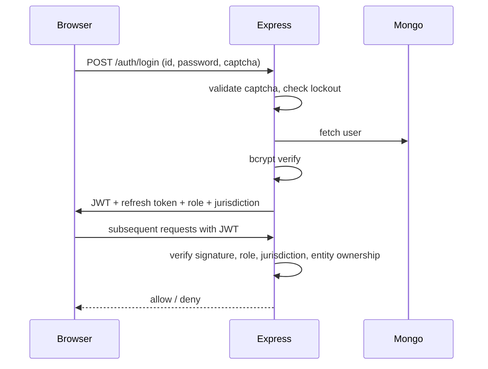
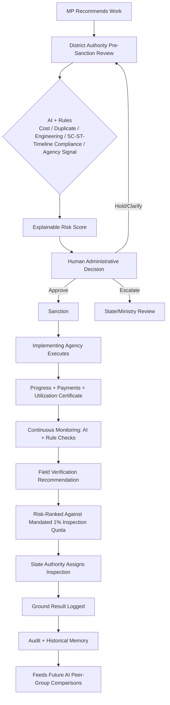

# architecture.md — SYSTEM ARCHITECTURE (Revised)

**Project:** MPLADS AI Risk Monitoring & Decision Support Platform
**Problem Statement:** SIH 26102
**Primary Application Stack:** MERN (React / Node.js+Express / MongoDB) + Python AI service
**Automation:** n8n (background/async only)
**AI/ML:** Python AI service (analytics/ML) + Gemini API (current LLM, explanation-only) via a provider-independent AI Gateway
**Future AI:** Ollama / local LLM + local embeddings
**Revision note:** This version corrects gaps found against the finalized `prd.md` — see the Traceability Matrix (§29) and Changelog (§30). It adds document/file storage, a concrete API catalog, an AI data-minimization rule, and trims one overengineered component (Atlas vector search at MVP scale).

---

## 1. Architecture Overview

The system is one web application with role-based workspaces, sitting as a **monitoring and decision-support layer alongside** the existing MPLADS sanction/execution workflow — not a replacement for it. A single backend (Express) is the sole authorization boundary; a single database (MongoDB) is the source of application truth; a Python service performs all numeric/ML analysis; an LLM (currently Gemini, swappable) only explains already-computed results; n8n automates background monitoring and notifications, never the synchronous decision path.

## 2. Architecture Goals

1. Implement every Must/Should-Have feature in the finalized PRD with a clear component owner.
2. Keep the pre-sanction and inspection-decision paths synchronous, fast, and independent of any component that could fail invisibly during a live demo.
3. Make every AI output explainable and every material decision human-terminated and logged.
4. Stay buildable and understandable by a 6-person student team in an SIH timeframe.
5. Leave a realistic, explicitly-marked path to production scale without over-building the prototype.

## 3. Architecture Principles

1. **One portal, multiple role-based workspaces.** Same login, role determines workspace/permissions/visibility.
2. **One centralized MongoDB source of truth**, collections separated by domain, connected by shared identifiers (`mp_id`, `project_id`, `agency_id`, `inspection_id`, `user_id`).
3. **Express is the application security boundary.** The frontend is never trusted for permissions.
4. **AI assists; humans decide.** No automated chain ends in sanction, rejection, payment-stoppage, or inspection order.
5. **n8n is automation, not the application backend.** The synchronous pre-sanction and inspection-decision paths do not depend on n8n.
6. **Use the right tool for the right job.** Deterministic rules and numeric calculations live in the backend/Python analytics layer; the LLM explains already-computed evidence, never invents figures.
7. **Minimize what leaves the system boundary.** Only structured, already-computed, de-identified evidence is sent to any external AI provider (see §15.5).
8. **Historical data is a first-class asset**, kept for future peer-group comparison, never silently overwritten.
9. **Real and synthetic data are permanently, queryably distinguishable.**
10. **Every important decision and access to sensitive records is auditable and tamper-evident.**

## 4. System Context



The platform reads/derives from MPLADS-style data (real allocation CSVs + synthetic demo data); it does not write back to or replace eSAKSHI in this phase.

---

## 5. High-Level Architecture



Frontend never calls the AI service or file storage directly — everything passes through Express, which enforces auth, RBAC, and jurisdiction on every request.

---

## 6. User Roles & Access Architecture

| Role | Primary Workspace | Data Scope | Can View Risk/AI Data | Can Approve/Decide | Can View Audit Log |
|---|---|---|---|---|---|
| MP | `/mp/*` | Own constituency | Own works only | No | No |
| District Authority | `/district/*` | District/jurisdiction | Yes, own jurisdiction | Yes (sanction, hold, clarify, inspect, escalate) | No (own actions only, via own history) |
| Engineer / Agency | `/agency/*` | Assigned projects | No (only clarification requests directed at them) | No | No |
| State Nodal Authority | `/state/*` | State | Yes, state-wide | Yes (inspection assignment, escalation) | No |
| Ministry / DIID | `/ministry/*` | National | Yes, aggregated/national | Policy-level only, no per-project sanction authority | Read-only, aggregated |
| Auditor | `/auditor/*` | Broad, read-only | Yes, full | No | Yes, full read-only |
| Admin | `/admin/*` | System/operational only | **No** — cannot view risk scores, decisions, or audit *content* | No | No — can view audit *system health* (log volume, failures) but not log *content* |

This restriction on Admin is deliberate: system administration (user/config management) must not double as a backdoor into sensitive decision or audit data.

Authentication/authorization flow:



---

## 7. Application Architecture

| Layer | Responsibility | Technology |
|---|---|---|
| Presentation | Landing page, login, role workspaces, dashboards, forms, charts | React |
| Application/API | AuthN/AuthZ, validation, business logic, CRUD, decision recording | Node.js + Express |
| Data | Source of truth, historical memory, AI results, audit records | MongoDB |
| File/Document | Utilization certificates, evidence, sanction orders, inspection photos | Object storage (see §14) |
| AI/ML | Cost anomaly, similarity, spec comparison, delay signals | Python |
| LLM | Explanation/summarization of already-computed evidence | Gemini (current), Ollama (future) via AI Gateway |
| Automation | Scheduled scans, notifications, escalation, ingestion | n8n |
| Governance | Audit logs, decision history, inspection history | MongoDB (append-oriented) |

## 8. Module/Service Architecture

- **Frontend (React):** landing, login, role dashboards, sanction-review panel, risk-explanation panel, decision forms, inspection queue/result forms, document upload widgets, charts/tables/filters.
- **Backend (Express):** auth, RBAC/jurisdiction, project lifecycle, payments/progress/UC recording, AI-service orchestration, document metadata, audit event creation. Sole authorization boundary; frontend and n8n never write to MongoDB directly.
- **AI Service (Python):** cost-anomaly, duplicate/similarity, engineering-spec diff, payment/progress consistency, optional delay-risk model, agency-suitability and concentration analytics. Stateless per-request; returns structured JSON, never mutates state itself.
- **AI Gateway:** thin abstraction so Express/AI-service code doesn't change when swapping Gemini ↔ Ollama.
- **n8n:** ingestion (CSV), scheduled monitoring scans, notification routing, escalation workflows. Calls back into Express via authenticated service credentials — never writes to MongoDB directly, and never sits in the synchronous pre-sanction or inspection-decision path.
- **File/Document Store:** stores binary content; MongoDB stores only metadata/references, never binary blobs.

This is a **modular monolith at the application layer** (Express) with two intentionally separate services (Python AI, n8n) — not a microservices architecture. That's the right call for a 6-person SIH team: it minimizes deployment surface while still isolating the two components (probabilistic AI, automation) that shouldn't be allowed to compromise the transactional core if they fail.

---

## 9. Core Business Workflow



---

## 10. Data Architecture

### 10.1 Core Entities (minimum required by the PRD)

| Entity | Purpose | Key Fields | Owner | Lifecycle |
|---|---|---|---|---|
| `users` | Identity + role + jurisdiction | user_id, role, jurisdiction, credentials | Admin (creation), self (profile) | Persistent |
| `mp_allocation` | Annual allocation only | mp_id, state, constituency, allocated_amount | Ingestion (real data) | Refreshed per source update |
| `fund_utilization` | Financial utilization snapshot | mp_id, expenditure, remaining_amount | Derived/ingested | Snapshot per period |
| `work_completion` / `completion_rates` | Portfolio summary | mp_id, totals | Derived | Snapshot per period |
| `projects` | Central historical project memory | project_id, mp_id, district, category, status, lifecycle stage | System (created on recommendation) | Never deleted; status transitions only |
| `project_recommendations` | Original MP recommendation, immutable | project_id, description, specs, estimated_cost | MP | Write-once |
| `engineering_reports` | Engineer-submitted technical detail, versioned | project_id, specs, cost, submitted_by, version | Engineer/Agency | Append-only (new version, not overwrite) |
| `project_progress` | Every progress update, versioned | project_id, date, % progress, notes | Engineer/Agency | Append-only |
| `project_payments` | One doc per payment | project_id, amount, date, status | Engineer/Agency (raises), District (approves) | Append-only |
| `utilization_certificates` | UC filing status per disbursement | project_id, payment_id, filed (bool), file_ref, filed_date | Engineer/Agency (uploads) | Append-only |
| `sc_st_area_reference` | Static reference: SC/ST-majority classification per constituency/ward | area_id, classification | Ingestion (govt reference data) | Rarely updated |
| `implementing_agencies` / `agency_performance` | Agency master + historical performance | agency_id, completion rate, delay avg, cost deviation | Ingestion + derived | Updated on project completion |
| `agency_concentration` | Derived view: work-value share per agency/district/year | agency_id, district, year, share | **Derived**, recomputed on schedule | Recomputed, not independently edited |
| `ai_risk_flags` | Individual AI/rule finding | project_id, type, score, explanation, model/rule, timestamp | AI service (writes via Express) | Append-only |
| `ai_risk_scores` | Current combined risk | project_id, component scores, overall, level | AI service (writes via Express) | Latest + history via `ai_analysis_history` |
| `ai_analysis_history` | Risk recalculation over time | project_id, score, timestamp | AI service | Append-only |
| `inspections` | Inspection lifecycle | inspection_id, project_id, priority, officer, status, result | State Authority / Engineer(assigned) | State machine (§9) |
| `officer_decisions` | Every administrative decision | project_id, officer_id, decision, reason, prev/new state | District/State officials | Append-only |
| `notifications` | Alert delivery record | recipient, type, project_id, status | n8n (via Express) | Time-bound |
| `audit_logs` | Complete tamper-evident action record | user_id, role, action, entity, timestamp, prev/new state | System (auto-written on every state-changing action) | Append-only, no update/delete API |
| `documents` (metadata only) | Reference to stored files (UCs, evidence, sanction orders, inspection photos) | doc_id, project_id, type, uploader, storage_ref, uploaded_at | Uploading role | Append-only |

MP-level "attention" indicators are implemented as a **derived/materialized view** over `ai_risk_scores` + `work_completion` — not an independently-maintained collection, avoiding a second source of truth.

### 10.2 Data Flow

```
Input (form/upload/CSV) → Validation (schema + business rules) → Store (MongoDB / File Store)
   → AI Processing (Python: cost/duplicate/spec/payment analysis) → Risk Aggregation (explainable)
   → Human Review (role-specific dashboard) → Decision (recorded) → Status Update
   → Audit Log Entry → Dashboard Refresh → Historical Memory (feeds future peer-group comparisons)
```

### 10.3 Data Sources

- **Government-provided:** allocation CSVs, any available real MPLADS-derived project/performance data, SC/ST-majority reference classification.
- **User-generated:** MP recommendations, engineering reports, progress/payment updates, officer decisions, uploaded documents.
- **AI-generated (derived, not source-of-truth):** risk flags/scores, similarity results, agency-suitability rankings, concentration metrics.
- **Synthetic (demo-only):** planted anomaly cases, tagged `is_synthetic: true`, never silently mixed with real data.

Source-of-truth data (`project_recommendations`, `engineering_reports`, `project_payments`, officer decisions) is never overwritten by derived/AI data. AI outputs are always a separate, clearly-labeled layer.

---

## 11. Database Design

**Chosen: MongoDB**, retained from the working prototype.

**Why:** flexible document structure for heterogeneous engineering-report shapes across work categories; centralized historical project memory; fast for a hackathon build timeline; already adopted, avoiding a costly mid-project migration.

**Compensating for the lack of native relational integrity** (required because this is a financial/audit system):
- Schema validation (JSON Schema per collection) rejecting malformed writes.
- Unique indexes on natural keys (`project_id`, `agency_id`, etc.) and compound indexes on common query patterns (`project_id + submitted_at`, `project_id + payment_date`).
- **Multi-document transactions** for any write touching money or status simultaneously (e.g., recording a payment and updating `fund_utilization` and the project's status must succeed or fail together).
- Application-level relationship validation in Express (referenced IDs must exist before a write commits).
- Append-only/immutable historical records for recommendations, progress, payments, decisions, and audit logs — never overwritten.

PostgreSQL remains a valid future alternative if the team later prioritizes strict relational guarantees over schema flexibility; this is a documented, not a forced, trade-off (see ADR §26.1).

**Indexing (representative, not exhaustive):**
```
users: user_id, official_email, role
projects: project_id (unique), mp_id, district, status, category
project_progress: project_id + submitted_at
project_payments: project_id + payment_date
ai_risk_scores: project_id, risk_level
inspections: project_id, status, priority
audit_logs: user_id, entity_id, timestamp
documents: project_id, type
```
Indexes should be finalized against actual query patterns and verified with profiling, not guessed upfront.

---

## 12. API Architecture

Frontend calls only `/api/*`. The AI service (`/ai/*`) is internal-only, reachable from Express, never directly from the browser or from n8n without going through Express.

| Domain | Method & Path | Purpose | Auth / Role |
|---|---|---|---|
| Auth | `POST /auth/login`, `POST /auth/logout`, `POST /auth/refresh`, `POST /auth/forgot-password`, `POST /auth/reset-password`, `GET /auth/me`, `GET /auth/captcha` | Session lifecycle | Public (login/captcha), JWT thereafter |
| Allocation | `GET /api/allocations`, `GET /api/allocations/:mpId` | View allocation | MP (own), District/State/Ministry (scoped) |
| Projects | `POST /api/projects/recommendation`, `GET /api/projects`, `GET /api/projects/:id`, `PATCH /api/projects/:id/decision` | Create/review/decide | MP (create), District (decision), scoped read for others |
| Engineering | `POST /api/projects/:id/engineering-report`, `GET /api/projects/:id/engineering-report` | Technical submission + comparison trigger | Engineer/Agency (write), District/Auditor (read) |
| Progress | `POST /api/projects/:id/progress`, `GET /api/projects/:id/progress` | Execution tracking | Engineer/Agency (write), scoped read |
| Payments | `POST /api/projects/:id/payments`, `GET /api/projects/:id/payments` | Financial tracking | Engineer/Agency (raise), District (approve), scoped read |
| Utilization Certificates | `POST /api/projects/:id/utilization-certificate`, `GET /api/projects/:id/utilization-certificate` | UC compliance | Engineer/Agency (upload), District/Auditor (read) |
| Documents | `POST /api/documents` (multipart, returns storage_ref), `GET /api/documents/:id` (authorized fetch only) | Evidence, sanction orders, inspection photos | Role-scoped, always via Express, never a public bucket URL |
| Risk | `GET /api/projects/:id/risk`, `GET /api/risk/high` | View AI risk findings | District/State/Ministry/Auditor (scoped) |
| Compliance | `GET /api/projects/:id/compliance`, `GET /api/compliance/sc-st-status/:mpId` | SC/ST + timeline compliance | MP (own), District/State/Ministry |
| Inspections | `GET /api/inspections`, `POST /api/inspections`, `PATCH /api/inspections/:id` | Inspection lifecycle | State (assign), Auditor (read), scoped |
| Agency Intelligence | `GET /api/agencies/:id/performance`, `GET /api/agencies/concentration` | Suitability + concentration (kept separate) | District (suitability), State/Ministry (concentration) |
| Dashboards | `GET /api/dashboard/mp/:mpId`, `GET /api/dashboard/district`, `GET /api/dashboard/state`, `GET /api/dashboard/ministry`, `GET /api/dashboard/auditor` | Aggregated role views | Role-scoped |
| Notifications | `GET /api/notifications`, `PATCH /api/notifications/:id/read` | Alerts | Self-scoped |
| Audit | `GET /api/audit-logs` | Full trail | Auditor only |
| Admin | `GET/POST/PATCH /api/admin/users`, `GET/PATCH /api/admin/config` | User/config management | Admin only; explicitly **no** access to risk/audit content endpoints above |
| AI (internal) | `POST /ai/cost-anomaly`, `POST /ai/duplicate-check`, `POST /ai/spec-comparison`, `POST /ai/payment-progress-check`, `POST /ai/delay-check`, `POST /ai/agency-suitability`, `POST /ai/agency-concentration` | Structured analysis | Internal only, called by Express |

This is not an exhaustive endpoint list — it defines the major boundaries a team should build against.

---

## 13. AI/ML Architecture

For each AI component: problem, input, technique, output, consumer, explainability, and failure behavior.

| Feature | Technique | Input | Output | Consumer | Explainable? | On AI failure |
|---|---|---|---|---|---|---|
| Cost-Estimate Anomaly | Robust z-score/IQR on peer group (category+region); Isolation Forest optional | category, specs, cost, region, date | anomaly score + "% vs. peer median" | District, State | Yes — always shows peer median and % deviation | `ai_status = UNAVAILABLE`; sanction review proceeds with a visible "AI check pending" flag, never a silent pass |
| Duplicate/Overlap Detection | TF-IDF or sentence embeddings + cosine similarity, combined with geo/ward proximity | description text, location, category, dates | ranked similar-pair list + similarity % | District, State | Yes — shows the matched historical record and score | Same as above |
| Engineering Spec Comparison | Deterministic field-diff + cost-per-unit deviation threshold | recommendation vs. engineer report vs. completion | field-level deviation list | District, Auditor | Yes — inherently a diff, fully explainable | Falls back to raw side-by-side display without a computed deviation flag |
| Payment/Progress Consistency | Rule-based threshold (+ optional simple statistical model if sufficient historical outcome data exists) | physical progress %, payment utilization % | mismatch flag + gap size | District, State | Yes | Rule still runs (deterministic); ML upgrade path only degrades gracefully to the rule |
| Delay/Staleness | Rule: days-since-update > threshold; optional ML classifier if enough labeled historical outcomes exist | sanction date, last update, payment history | staleness flag / delay-risk probability | District, State | Yes for the rule; ML version requires feature importance disclosure | Rule always available even if ML model unavailable |
| Agency Suitability (advisory) | Simple weighted ranking on historical performance | completion rate, delay, cost deviation, inspection outcomes | ranked suggestion, e.g. "PWD: 91" | District (advisory only) | Yes | No ranking shown; District selects manually |
| Agency Concentration | Aggregation + Herfindahl-style share metric (statistics, not ML) | agency_id, work value, district, year | concentration score, flagged above threshold | State, Ministry | Yes — inherently a computed statistic | Recomputed on next schedule; not demo-critical path |
| Risk-Score Aggregation | Explainable weighted sum or interpretable model (logistic regression / shallow GBT with SHAP) — **never an opaque deep model** | outputs of all above + compliance flags | overall score + level + contributing-signal breakdown | All roles (scoped) | Yes, mandatory — every score must show contributing signals | If any input signal is unavailable, aggregation proceeds with the available subset and flags which inputs were missing |
| SC/ST Quota & Timeline Compliance | Deterministic rule engine, **not AI** | recommendation history, sc_st_area_reference, dates | COMPLIANT / REVIEW_REQUIRED / NON_COMPLIANT | MP, District | Rule is inherently self-explaining | N/A — deterministic, does not "fail" the way ML can |
| Utilization Certificate Compliance | Deterministic rule, **not AI** | payment date, UC filing status | compliance flag | District, Auditor | Inherently self-explaining | N/A |
| LLM Explanation Layer | Gemini (current) / Ollama (future) via AI Gateway | already-computed structured evidence only (never raw applicant/agency PII, never raw financial account data) | officer-readable natural-language explanation | All roles viewing a flag | Explanation *of* an explainable result, not a black box itself | If LLM unavailable, the structured evidence (numbers + labels) is still shown without prose — never blocks the decision |

**Explicitly not built (per PRD §11 Non-Goals):** LLM-based eligibility-category classification (hallucination risk on a compliance-critical decision — handled as a deterministic picklist at data entry instead).

**Human approval requirement:** every row above feeds a human decision point (District/State officer action) — no row here can independently change `projects.status`, stop a payment, or trigger an inspection.

---

## 14. Document/File Architecture *(new)*

**Component:** Object storage (S3-compatible; local filesystem-backed for dev, a hosted S3-compatible bucket for the demo/prototype deployment).

**What's stored here:** utilization certificates, inspection photos/evidence, sanction orders, any supporting attachment. **Never** stored here: structured transactional data (that stays in MongoDB) or secrets.

**Flow:**
```
Upload (React, multipart) → Express (auth + role check + file-type/size validation)
   → Object Storage (binary) → MongoDB documents collection (metadata + storage_ref)
   → Audit log entry (upload event)
```

**Security requirements specific to uploads:**
- Server-side file-type allowlist (PDF/JPEG/PNG only for UCs and inspection evidence) and size limits.
- Files are never served from a public bucket URL — every fetch goes through `GET /api/documents/:id`, which re-checks role/jurisdiction before streaming the file.
- Basic malware-scanning posture noted as a production requirement; for the SIH prototype, type/size validation plus authenticated-fetch-only is the realistic MVP bar.
- Every upload and every authorized fetch is an audit-logged event.

---

## 15. Authentication & Authorization

(See §6 diagram.) Summary: bcrypt password hashing → JWT (short-lived) + refresh token → every subsequent request re-verified for signature, role, and jurisdiction/entity ownership before any data is returned or written. The frontend route determines *which workspace renders*; it never determines *what data is allowed* — that check happens in Express on every request, independent of the UI.

### 15.5 AI Data Minimization *(new — closes a security gap)*

Because this is a government financial-compliance system, what is sent to any **external, cloud-hosted** LLM provider (currently Gemini) is deliberately restricted:
- Only **already-computed, structured evidence** is sent for explanation (e.g., "cost ₹63L vs. peer median ₹22L, +186%"; "similarity 82% vs. Project PRJ-014") — never raw applicant names, raw financial account details, or full uploaded documents.
- Prompts are built server-side from a fixed template populated with de-identified structured fields; the LLM is never given direct database or file-storage access.
- This is documented explicitly as the reason the AI Gateway / local-LLM (Ollama) path matters for **production** deployment, not merely as a future convenience — a real government deployment should default to a controlled/local model, and the Gateway abstraction exists specifically so this can be changed without touching Express, the AI service, or the frontend.

---

## 16. Security Architecture

```
Browser → HTTPS → Express [JWT, RBAC, jurisdiction, validation, rate limit, business authorization] → MongoDB / File Storage / AI Service
```

Requirements: bcrypt, refresh tokens, server-side CAPTCHA, login lockout, rate limiting, secure secrets management (never committed, `.env.example` holds placeholders only), protected AI-service and n8n endpoints (dedicated service credentials, never a human JWT reused as a service token), input validation on every write, file-upload validation (§14), and the AI data-minimization rule (§15.5). Encryption at rest/in transit and formal government-SSO integration are described as production requirements, not over-built for the prototype.

## 17. Audit & Accountability

Every state-changing action (login, project creation/modification, document upload, approval/rejection, financial change, AI recommendation generation, manual override, status change, inspection assignment/result) writes an append-only audit record: `user_id, role, action, entity_type, entity_id, project_id (where applicable), timestamp, reason, previous_state, new_state`. Audit logs have no update/delete API — only Auditors (and, for system-health metadata only, Admins) can read them; ordinary users cannot modify or view others' entries.

## 18. Notification Architecture

Event-triggered (n8n-routed, backend-authorized) on: new high-risk flag, SC/ST quota threshold approaching/breached, overdue utilization certificate, stale/delayed work crossing threshold, inspection assignment, escalation. Routed by severity/jurisdiction/responsibility (e.g., cost anomaly → District; systemic pattern → Ministry; UC overdue → District/Auditor).

## 19. Integration Architecture

- **Real government data ingestion:** CSV import (allocation, any available MPLADS-derived project/performance data) via n8n, validated and tagged `is_real_government_data: true`.
- **Synthetic demo data:** loaded via the same ingestion path, tagged `is_synthetic: true`, never silently merged with real data.
- **Live eSAKSHI integration:** explicitly out of scope for this phase (no access/authorization); the architecture is designed so a future integration would enter through the same ingestion boundary as the CSV path, not require a redesign.
- **LLM provider:** Gemini today, Ollama in future, both behind the AI Gateway (§13, §15.5).

## 20. Error Handling & Resilience *(expanded)*

| Scenario | Behavior |
|---|---|
| AI service unavailable | `ai_status = UNAVAILABLE`; sanction review proceeds with a visible "AI check pending" flag — never a silent low/safe score |
| Database unavailable | Request fails fast with a safe error; no partial writes (transactions used for multi-document money/status updates) |
| File upload fails | Upload rejected client-side and server-side with a clear message; no partial/orphaned document metadata record is created |
| External API (Gemini) fails | Structured evidence (numbers/labels) still displayed without prose explanation; decision is never blocked on the LLM |
| User submits invalid data | Rejected at validation layer with field-level errors; nothing is partially persisted |
| Duplicate project submitted | Not silently blocked — surfaced *as* a duplicate-detection flag (§13) for human review, since a legitimate near-identical work can exist; the system flags, it doesn't reject |
| Approval rejected / clarification requested | Project returns to `DISTRICT_REVIEW` / `CLARIFICATION_REQUIRED` state; MP or Agency can resubmit updated information, which creates a **new version**, not an overwrite, of the relevant record |
| User changes previously submitted information | Stored as a new versioned record (engineering report v2, etc.); prior version retained for audit/explainability |
| Incorrect AI recommendation occurs | Officer marks the flag outcome as `FALSE_POSITIVE`; this is logged for future threshold tuning, never used to silently auto-correct the model in production |
| Network connection fails (client) | Frontend shows a retry-safe "unable to load / try again" state; no duplicate submission on retry (idempotency key on write endpoints) |
| Document cannot be processed (unreadable file) | Rejected at upload with a clear reason; original submission (e.g., the payment record) is unaffected |
| Required data missing | Data-quality flag raised before AI analysis runs; the record does not silently enter AI scoring incomplete |
| n8n unavailable | Core application transactions (login, sanction decision, inspection decision) remain fully valid; only background monitoring/notifications are delayed |

## 21. Logging & Monitoring

- **Backend:** request latency, error rates, failed authentication attempts, database errors.
- **AI service:** analysis latency, model failures, missing input, confidence/similarity distribution.
- **n8n:** workflow success/failure, execution duration, retry count.
- **Database:** slow queries, index usage, connection failures.
- **File storage:** upload failures, unauthorized access attempts.

## 22. Deployment Architecture

**Development:** local machine — React dev server, Express, Python AI service, MongoDB (local or Atlas free tier), n8n (local), local filesystem standing in for object storage.

**SIH Prototype/Demo:** a simple, single-environment deployment — React build served statically, Express + Python AI service as two processes/containers, MongoDB Atlas (free/shared tier is sufficient at demo scale — **no Atlas Vector Search tier required**, see §26.3), n8n for background jobs only, a small S3-compatible bucket (or equivalent) for documents. Everything needed for the live demo path (login → sanction review → AI flag → decision → dashboard) must work without n8n or the LLM provider being strictly available (graceful degradation per §20).

**Future Production:** horizontally scaled Express instances behind a load balancer, MongoDB with proper sharding/replica strategy if data volume warrants it, Python AI service scaled independently, n8n or a more robust workflow engine, managed object storage, and the AI Gateway pointed at a local/controlled LLM for data-sovereignty reasons (§15.5).

## 23. SIH/MVP Architecture

Matches PRD MVP phasing:
- **Phase 1:** landing, auth/RBAC, MongoDB core, `mp_allocation`, MP dashboard.
- **Phase 2:** projects/recommendations, cost anomaly, duplicate detection (in-memory similarity, not Atlas vector search), explainable risk engine, District dashboard.
- **Phase 3:** n8n background automation, officer decisions, State dashboard, inspection queue tied to the 1% mandate, audit trail.
- **Phase 4:** engineering comparison, payment/progress consistency, UC tracking, agency concentration analytics, document storage, field-verification recommendation.
- **Phase 5 (stretch/production-facing):** delay-risk ML upgrade, agency suitability, fund-utilization forecasting, local LLM, mobile field-inspection module, Atlas Vector Search if dataset scale later justifies it.

## 24. Future Production Architecture

Live eSAKSHI API integration; horizontally scaled services; managed object storage; local/offline LLM as the default for data-sovereignty; Atlas Vector Search (or a dedicated vector DB) once duplicate-detection corpus size actually requires approximate-nearest-neighbor search rather than in-process cosine similarity; mobile inspection app; extensibility to other MP/MLA local-area schemes.

## 25. Technology Stack

| Layer | Technology | Requirement satisfied | Necessary? | Simpler alternative? | Team-realistic? |
|---|---|---|---|---|---|
| Frontend | React | Role dashboards, forms, charts | Yes | — | Yes |
| Backend | Node.js + Express | Auth/RBAC/business logic boundary | Yes | — | Yes |
| Database | MongoDB (+ schema validation/transactions) | Central store, flexible schema, historical memory | Yes, with compensations | PostgreSQL (more relational safety, less schema flexibility) | Yes |
| AI/ML | Python (scikit-learn, TF-IDF/embeddings) | Cost anomaly, similarity, comparisons | Yes | — | Yes |
| LLM | Gemini (current), Ollama (future) via AI Gateway | Natural-language explanation only | Yes, scoped narrowly | — | Yes |
| Vector search | **In-process cosine similarity for MVP**; Atlas Vector Search deferred | Duplicate detection at demo scale | Simpler option is sufficient now | Atlas Vector Search only once corpus size justifies it | Yes — removes a cloud-tier dependency from the demo |
| Automation | n8n | Background monitoring/notifications | Yes, scoped to non-critical path | — | Yes |
| File storage | S3-compatible object storage | UC/evidence/document uploads | Yes — was missing | — | Yes |
| Message queue | None | Not required at this scale; n8n covers async needs | N/A | — | — |
| Cache | None for MVP | Not required at demo scale | N/A | — | — |
| Search (free-text) | Not included | No PRD feature requires general search | N/A | — | — |

---

## 26. Architecture Decisions (ADRs)

### 26.1 MongoDB over PostgreSQL
**Options considered:** MongoDB (flexible schema), PostgreSQL (relational integrity).
**Selected:** MongoDB, with schema validation, transactions, and application-level relationship checks as compensating controls.
**Reason:** already adopted in the working prototype; flexible for heterogeneous engineering-report shapes; faster to iterate on for a hackathon timeline.
**Trade-off:** weaker native referential integrity than a relational DB — explicitly compensated for (§11), and documented as revisitable in a future production phase.

### 26.2 n8n scoped to background automation only
**Options considered:** n8n in the synchronous pre-sanction path; n8n for background-only automation.
**Selected:** background-only.
**Reason:** removes a third-party workflow engine from the exact path being demonstrated live to judges.
**Trade-off:** slightly more direct integration code in Express for the synchronous AI call, in exchange for demo reliability.

### 26.3 In-process similarity over Atlas Vector Search for MVP
**Options considered:** MongoDB Atlas Vector Search; in-process cosine similarity in the Python AI service.
**Selected:** in-process similarity for MVP; Atlas Vector Search deferred to Future Production.
**Reason:** the SIH demo dataset is small (real allocation data + a handful of planted synthetic cases); Atlas Vector Search requires a specific cluster tier and adds a cloud-dependency risk with no benefit at this scale.
**Trade-off:** in-process search does not scale to a full national dataset — explicitly deferred to production, where duplicate-detection corpus size would justify a real vector index.

### 26.4 Gemini (cloud LLM) for explanation, with a data-minimization rule
**Options considered:** send full project records to Gemini for richer explanations; send only structured, de-identified evidence.
**Selected:** structured, de-identified evidence only (§15.5).
**Reason:** this is a government financial-compliance system; minimizing what leaves the system boundary is a reasonable default even in prototype form, and it establishes the pattern the production local-LLM path will need anyway.
**Trade-off:** slightly less rich natural-language explanations than an LLM given full context, in exchange for a real data-sovereignty posture.

### 26.5 Modular monolith over microservices
**Options considered:** microservices per domain; modular monolith (Express) + two separate services (Python AI, n8n).
**Selected:** modular monolith + two services.
**Reason:** minimizes deployment complexity for a 6-person student team while still isolating the two components (probabilistic AI, automation) that should not be allowed to compromise the transactional core on failure.
**Trade-off:** less independent scalability per domain than full microservices — acceptable at MVP scale, revisitable in production (§24).

---

## 27. Risks & Mitigations

- **AI service or LLM unavailable during demo** → graceful degradation (§20): decision path still works, just without an AI opinion for that moment.
- **n8n unavailable** → core transactional flows unaffected (§20, §26.2).
- **MongoDB relational-integrity gap** → schema validation + transactions + application-level checks (§11).
- **Sensitive data sent to a cloud LLM** → data-minimization rule (§15.5) + AI Gateway enabling a future local-model default (§26.4).
- **Vector search cloud-tier dependency** → removed from MVP scope (§26.3).
- **Agency-suitability feature reinforcing the very concentration pattern §12.7 is meant to catch** → capped/flagged repeated top-recommendations to the same agency (kept from PRD §12.8), enforced in the AI service logic, not left as a documentation-only guardrail.
- **File uploads as an attack surface** → type/size validation, authenticated-fetch-only access, no public bucket URLs (§14).
- **Over-claiming AI accuracy** → all demo metrics are reported against a labeled planted-anomaly dataset, never as real-world claims (per PRD §29).

## 28. Scalability Strategy

Horizontal scaling path: React (static, CDN-friendly) → multiple Express instances behind a load balancer → MongoDB (replica set now, sharding if/when volume warrants) → Python AI service scaled independently of Express → n8n/workflow engine scaled independently for background load. No microservices split is required to reach a realistic production scale from this starting point; the two services already separated (AI, automation) are the ones that would need independent scaling first.

---

## 29. Architecture Traceability Matrix

| PRD Requirement | Architecture Component | Data / API | User / Role | AI Component | Status |
|---|---|---|---|---|---|
| Cost-Estimate Anomaly Detection (§12.1) | Python AI service | `ai_risk_flags`, `POST /ai/cost-anomaly` | District, State | Statistical peer-group outlier | Implemented |
| Duplicate/Overlap Detection (§12.2) | Python AI service (in-process similarity, MVP) | `ai_risk_flags`, `POST /ai/duplicate-check` | District, State | TF-IDF/embeddings + geo proximity | Implemented |
| Explainable Risk Aggregation (§12.3) | Risk Engine (backend/Python) | `ai_risk_scores`, `GET /api/projects/:id/risk` | All (scoped) | Weighted/interpretable model | Implemented |
| Risk-Ranked 1% Inspection (§12.3) | Inspection Prioritization module | `inspections`, `GET /api/inspections` | State Authority | Feeds from Risk Engine | Implemented |
| Engineering Spec Comparison (§12.4) | Python AI service | `engineering_reports`, `POST /ai/spec-comparison` | District, Auditor | Deterministic diff | Implemented |
| Payment/Progress Consistency (§12.5) | Python AI service | `project_payments`, `project_progress`, `POST /ai/payment-progress-check` | District, State | Rule + optional stats | Implemented |
| Delay/Staleness (§12.6) | Rule engine + optional ML | `project_progress` | District, State | Rule (base), classifier (upgrade) | Implemented |
| Agency Concentration (§12.7) | Derived analytics job | `agency_concentration` | State, Ministry | Statistical (Herfindahl) | Implemented |
| Agency Suitability + guardrail (§12.8) | Python AI service | `agency_performance`, `POST /ai/agency-suitability` | District (advisory) | Weighted ranking + concentration cap | Implemented |
| SC/ST Quota + Timeline Compliance (§12.9) | Compliance Engine | `sc_st_area_reference`, `GET /api/compliance/sc-st-status/:mpId` | MP, District | None — deterministic | Implemented |
| Utilization Certificate Compliance (§12.10) | Compliance Engine + File Storage | `utilization_certificates`, `documents` | District, Auditor | None — deterministic | Implemented |
| Document/evidence upload | File/Document Architecture (§14) | `documents`, `POST/GET /api/documents` | Agency, District, State | N/A | **Added this revision** |
| API surface for all functional requirements | API Architecture (§12) | See endpoint table | All roles | N/A | **Added this revision** |
| AI data-minimization / sovereignty | AI Gateway + §15.5 rule | N/A | N/A | Applies to LLM layer only | **Added this revision** |
| RBAC incl. Admin restriction | Auth/RBAC middleware | `users` | All roles | N/A | **Clarified this revision** |
| Full audit trail | Audit Architecture (§17) | `audit_logs` | Auditor (read), system (write) | N/A | Implemented |
| Real vs. synthetic data discipline | Data Architecture (§10.3) | tag on all ingested records | All (dashboards can filter) | N/A | Implemented |
| Human-in-the-loop, no autonomous decisions | Decision Architecture (§9, §13) | `officer_decisions` | District/State/Ministry officials | All AI outputs are advisory | Implemented |

---

## 30. Changelog from Prior Draft

- **Added:** Document/File Architecture (§14) for UCs, evidence, sanction orders, inspection photos — previously absent.
- **Added:** Concrete API Architecture (§12) with method/path/role for every major domain — previously only conceptual flows.
- **Added:** AI Data Minimization rule (§15.5) and its own ADR (§26.4) — sending government financial data to a cloud LLM was previously unaddressed.
- **Added:** Expanded Error Handling & Resilience table (§20) covering duplicate submission, rejected/resubmitted approvals, document-processing failure, and idempotent retries.
- **Modified:** Duplicate-detection technique downgraded from MongoDB Atlas Vector Search to in-process cosine similarity for MVP scale (§26.3), with vector search explicitly deferred to Future Production (§24).
- **Modified:** Admin role explicitly restricted from viewing risk/audit *content* (§6), previously unstated.
- **Modified:** Agency-suitability concentration guardrail (PRD §12.8) now explicitly required in AI-service logic, not just documentation (§27).
- **Preserved as-is (already correct from the prior draft):** single-portal role routing, Express-as-boundary principle, n8n scoped to background automation, MongoDB retained with integrity compensations, explainable risk aggregation, 1%-inspection framing, SC/ST and UC compliance flows, human-in-the-loop decision architecture, real-vs-synthetic data discipline, team explanation summaries.

---

## 31. Final Architecture Summary

> React provides one unified, role-routed portal. Express is the sole application security boundary — authentication, authorization, jurisdiction, validation, and business logic all live there. MongoDB is the central, schema-validated, transaction-protected source of truth, with object storage handling documents/evidence separately. Python performs all numeric and ML analysis; an AI Gateway lets the explanation layer run on Gemini today and a local model in production, with only de-identified structured evidence ever leaving the system boundary. n8n automates background monitoring and notifications only — never the synchronous sanction or inspection decision path. Every AI output is explainable and advisory; every material decision is made and logged by a named human authority. The design is a modular monolith plus two isolated services, deliberately avoiding microservices, Atlas Vector Search, and other infrastructure the prototype's scale doesn't yet justify — with an explicit, documented path to each of those in a future production phase.
